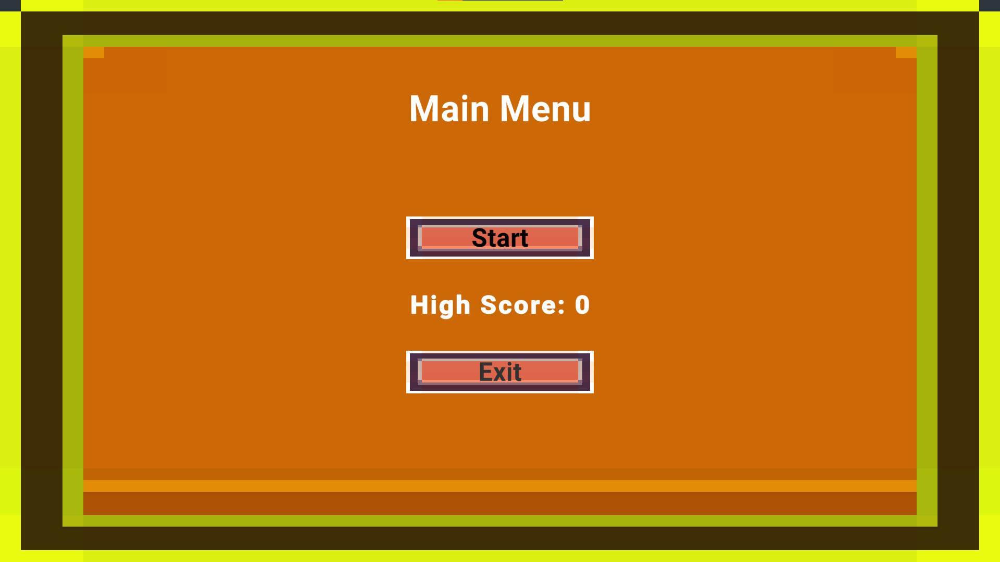

# Tetris Unity Project


## Giới thiệu

Đây là dự án game Tetris được phát triển bằng Unity. Trò chơi tái hiện lại trò chơi xếp gạch kinh điển với giao diện hiện đại, hiệu ứng mượt mà và âm thanh sống động.

## Tính năng nổi bật
- Giao diện thân thiện, dễ chơi
- Hiệu ứng chuyển động mượt mà
- Âm thanh sống động
- Lưu điểm cao
- Hỗ trợ chơi trên nhiều nền tảng

## Hướng dẫn cài đặt và chạy game
1. Clone repository về máy:
   ```sh
   git clone https://github.com/luuconghoangnam/game-Tetris.git
   ```
2. Mở project bằng Unity Hub hoặc Unity Editor (phiên bản khuyến nghị: 2021 trở lên)
3. Mở scene chính tại `Assets/Scenes/Main.unity`
4. Nhấn Play để bắt đầu trải nghiệm game

## Ảnh gameplay




## Đóng góp
Mọi đóng góp, ý kiến hoặc báo lỗi xin vui lòng tạo issue hoặc pull request trên repository này.

## Tác giả
- Lưu Công Hoàng Nam

---

> Dự án mang tính học thuật, phi thương mại.
